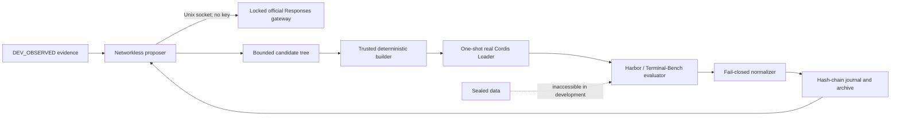

# dsh-self-evolving

[English](README.md) | [简体中文](README.zh-CN.md)

[](https://github.com/timwhitez/dsh-self-evolving/actions/workflows/ci.yml)
[](https://github.com/timwhitez/dsh-self-evolving/releases/tag/dsh-self-evolving-v0.2.0)
[](LICENSE)
[](package.json)
[](package.json)
[](docs/audits/2026-08-15-v0.2-provider-effectiveness.md)

An evidence-first, crash-resumable self-evolution engine for
[DeepSeek Harness](https://github.com/deepseek-ai/DeepSeek-Harness). It generates bounded Cordis plugin candidates,
runs them through isolated real-Loader admission, evaluates them with Harbor, and preserves an auditable lineage.

> [!IMPORTANT]
> v0.2.0 verifies stable iteration and a measurable fixed-replay engineering effect. It does **not** claim a
> Terminal-Bench score improvement, sealed promotion, leaderboard result, or SOTA performance.

## Why this project exists

Self-modifying agent systems are easy to demo and hard to trust. `dsh-self-evolving` treats every candidate as
untrusted and makes the controller, evaluator, budget, dataset split, and safety policy part of a trusted computing
base. A result is accepted only when its source identity, evidence, cost, lifecycle, and recovery path reconcile.

The project is a standard DSH Cordis plugin/service—not a fork of DSH and not a second controller wrapped around it.

## What is verified

| Capability                                           | Evidence-backed status                                              |
| ---------------------------------------------------- | ------------------------------------------------------------------- |
| Standard DSH/Cordis controller and candidate plugins | Verified with the real Cordis Loader                                |
| Bounded multi-file candidate generation              | Verified through a networkless proposer sandbox                     |
| Official DeepSeek Responses provider                 | Verified with three credential-gated real-provider cases            |
| Deterministic build and isolated capsule admission   | Verified with double builds and offline Loader E2E                  |
| Durable journal, budget, and crash recovery          | Verified with injected process kills and replay audits              |
| Stable K=3 iteration                                 | Verified with three unique admitted descendants                     |
| Fixed-replay engineering effect                      | `ENGINEERING_EFFECT_VERIFIED` for solve; propose remained unchanged |
| Terminal-Bench improvement / sealed / leaderboard    | **Not run; no claim**                                               |

The exact scope and hashes are recorded in the
[v0.2 acceptance audit](docs/audits/2026-08-15-v0.2-provider-effectiveness.md) and
[project status](PROJECT_STATUS.md).

## Architecture



- The controller is the only durable writer.
- Provider credentials stay in the trusted host and never enter the proposal sandbox or candidate.
- Candidates may change only their declared package; evaluator, scorer, split, route, and safety policy are fixed.
- Every external action is journaled before launch and reconciled exactly once after restart.

See [Architecture overview](docs/architecture-overview.md) and the
[trust-boundary specification](specs/05-safety.md).

## Quick start

### Requirements

- Ubuntu 24.04 x86_64
- Node.js 22.19+ or 24+
- pnpm 11.7.0 through Corepack
- Docker with a working daemon
- Python 3.12, `uv`, and Bubblewrap
- A DeepSeek API key for real model runs; local validation does not require one

### Install from source

```bash
git clone https://github.com/timwhitez/dsh-self-evolving.git
cd dsh-self-evolving
corepack enable
pnpm setup:source
```

### Install the controller bundle from npm

The controller is published on npm as `@dsh-self-evolving/core`. Install it into a headless profile with an
explicit state root and run id — omission fails Config validation by design:

```bash
export DSH_SELF_EVOLVING_STATE_DIR="${XDG_STATE_HOME:-$HOME/.local/state}/dsh-self-evolving/demo-1"
export DSH_SELF_EVOLVING_RUN_ID=demo-1
dsh plugin --profile headless add @dsh-self-evolving/core@0.2.0
```

`setup:source` installs this workspace and materializes the three upstream repositories at the exact commits in
[`provenance.lock.json`](provenance.lock.json). It refuses mismatched or dirty upstream checkouts.

### Initialize and inspect a run

Keep the credential in the trusted shell only:

```bash
export DEEPSEEK_API_KEY='...'
export DSH_STATE_DIR="${XDG_STATE_HOME:-$HOME/.local/state}/dsh-self-evolving/demo-1"

pnpm dsh-self-evolving init \
  --run-id demo-1 \
  --state-dir "$DSH_STATE_DIR" \
  --repo-root "$PWD" \
  --budget-usd 5

pnpm dsh-self-evolving doctor --state-dir "$DSH_STATE_DIR"
pnpm dsh-self-evolving run --state-dir "$DSH_STATE_DIR"
pnpm dsh-self-evolving status --state-dir "$DSH_STATE_DIR"
pnpm dsh-self-evolving audit --state-dir "$DSH_STATE_DIR"
```

Use `resume`, never a second `run`, after interruption. State directories are private evidence and must not be
committed. The complete workflow is in the [Quickstart](docs/quickstart.md).

## Low-cost effectiveness check

The effectiveness gate asks one real proposal to change the preregistered `solve` replay while preserving the
`propose` control replay:

```bash
export DSH_SELF_EVOLVING_EFFECT_RUN_ID='effect-local-1'
export DSH_SELF_EVOLVING_EFFECT_RECEIPT_PATH="$PWD/evidence/effectiveness/effect-local-1.json"
pnpm effectiveness:official
```

An accepted receipt contains hashes, token usage, and estimated cost—but no API key, reasoning text, provider body,
or private trajectory. The checked-in reference receipt estimated USD 0.0176861328 at the frozen price schedule.
That estimate covers the accepted receipt only, not arbitrary retries or a benchmark campaign.

## Verify the checkout

```bash
pnpm format:check
pnpm lint
pnpm typecheck
pnpm test
env -u DEEPSEEK_API_KEY pnpm test:e2e
pnpm provenance:check
pnpm upstream:check
pnpm byteequal:check
pnpm release:check
```

Real-provider tests are opt-in because they incur API charges:

```bash
pnpm test:provider:official
pnpm effectiveness:official
```

## Documentation

| Start here                                       | Purpose                                                              |
| ------------------------------------------------ | -------------------------------------------------------------------- |
| [Documentation index](docs/README.md)            | Find setup, architecture, operation, evidence, and release documents |
| [Quickstart](docs/quickstart.md)                 | Install and run the bounded stable demo                              |
| [Configuration](docs/configuration.md)           | Frozen profiles, limits, provider route, and credentials             |
| [Architecture](docs/architecture-overview.md)    | Components, data flow, and isolation boundaries                      |
| [Evidence guide](docs/evidence-guide.md)         | What each artifact proves—and does not prove                         |
| [Operations](docs/operations.md)                 | Stop, backup, restore, rollback, and uninstall                       |
| [Troubleshooting](docs/troubleshooting.md)       | Fail-closed errors and recovery procedures                           |
| [DSH upstream policy](docs/upstream-policy.md)   | Reproducible pinning and the latest compatibility channel            |
| [v0.2 release gates](docs/v0.2-release-gates.md) | Current acceptance contract and optional post-release scope          |

The normative specifications live in [`specs/00`–`specs/07`](specs/). When documents disagree, precedence is:
frozen run manifest → specifications → operational docs → README → historical discussion.

## Project boundaries

- DSH, Harbor, and Terminal-Bench checkouts are pinned read-only upstreams.
- `pnpm setup:source` installs the accepted DSH pin automatically; a separate scheduled workflow tests current DSH
  `HEAD` without silently rebinding a release.
- Development evidence may guide iteration; concealed and sealed evaluation data may not.
- K=10/K=80 search, sealed confirmation, full-set evaluation, and leaderboard submission are optional post-release
  profiles and are not part of the v0.2 acceptance claim.
- This repository does not authorize financial trading or real-world order execution.

## Contributing and security

Read [CONTRIBUTING.md](CONTRIBUTING.md) before opening a pull request. Changes to protocols, trust boundaries,
provider routes, splits, metrics, or retry semantics require an ADR and a fresh run lineage.

Do not report credential leaks, sandbox escapes, or concealed-data exposure in a public issue. Follow
[SECURITY.md](SECURITY.md) and use GitHub private vulnerability reporting after publication.

Community participation follows the [Code of Conduct](CODE_OF_CONDUCT.md).

## License

Licensed under [Apache License 2.0](LICENSE). DeepSeek Harness, Harbor, Terminal-Bench, and their dependencies retain
their respective licenses and trademarks.
